- [Nouilles au poulet et aux poivrons : Recette de Nouilles au poulet et aux poivrons](https://www.marmiton.org/recettes/recette_nouilles-au-poulet-et-aux-poivrons_308387.aspx)
	- URL:: [Nouilles au poulet et aux poivrons : Recette de Nouilles au poulet et aux poivrons](https://www.marmiton.org/recettes/recette_nouilles-au-poulet-et-aux-poivrons_308387.aspx)
	  Date:: [[2025/01/05]]
	- [Accueil](https://www.marmiton.org/) > [Recettes](https://www.marmiton.org/recettes) > [plat principal](https://www.marmiton.org/recettes/index/categorie/plat-principal/) > [pâtes, riz, semoule](https://www.marmiton.org/recettes/index/categorie/pates-riz-semoule/) > [autres pâtes](https://www.marmiton.org/recettes/index/categorie/autres-pates/) > Nouilles au poulet et aux poivrons
	- 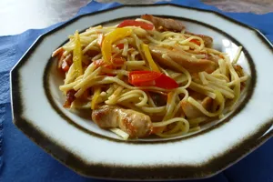
	- 30 min
	- ●
	- très facile
	- ●
	- bon marché
	- Ingrédients
	- −
	- personnes
		-
	- 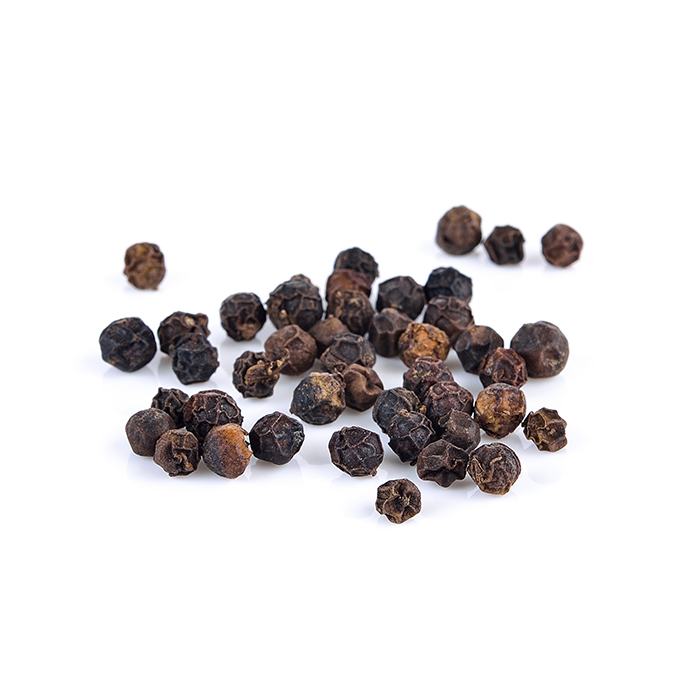{:width 115 :height 115}
	- poivre
	- 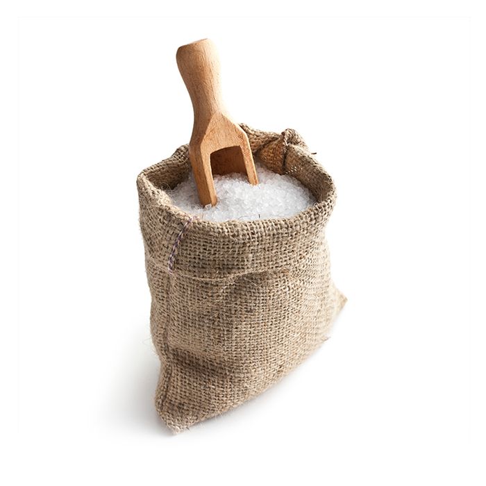{:width 115 :height 115}
	- sel
	- 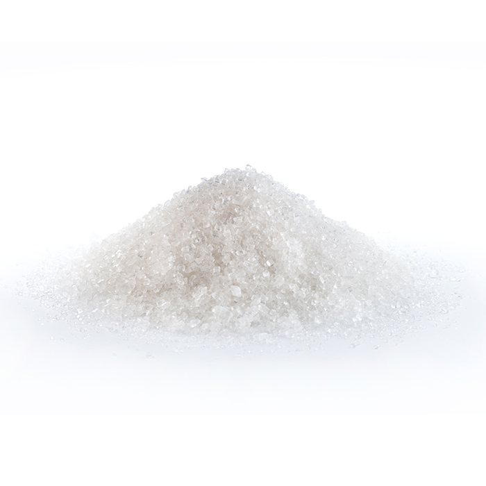{:width 115 :height 115}
	- 1 petite cuillère de sucre
	- {:width 115 :height 115}
	- 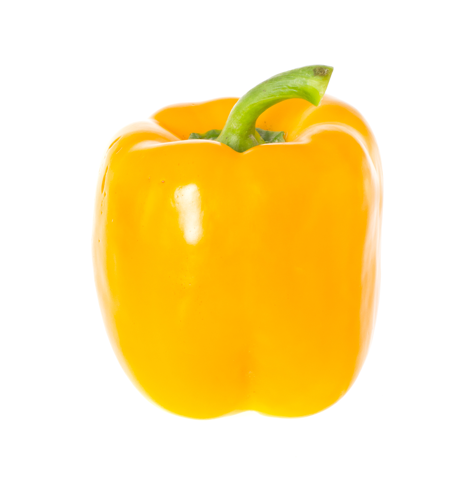{:width 115 :height 115}
	- 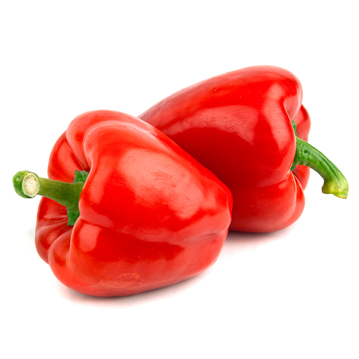{:width 115 :height 115}
	- 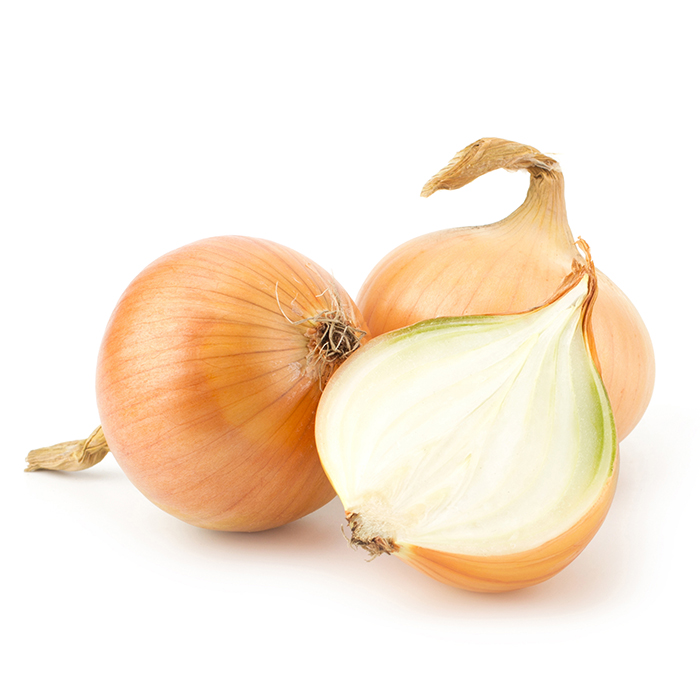{:width 115 :height 115}
	- 2 oignons moyens
	- 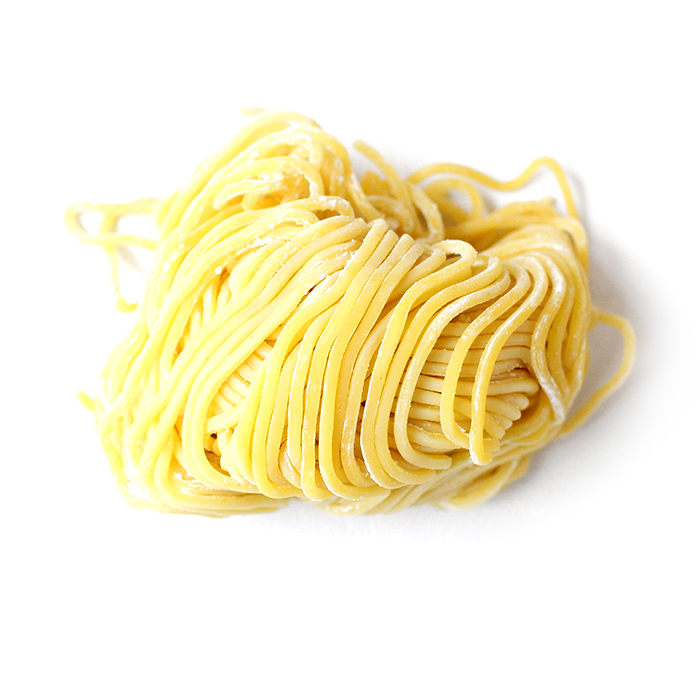{:width 115 :height 115}
	- 2 poignées de nouilles fines
	- 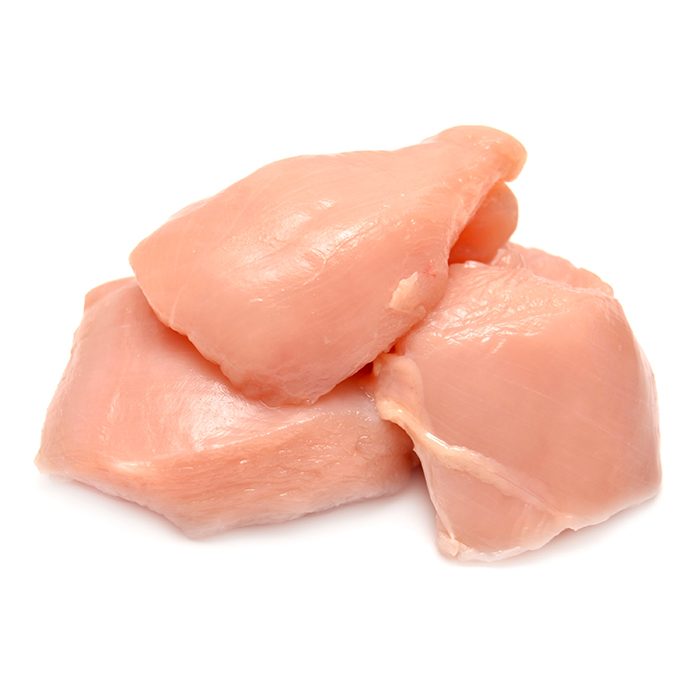{:width 115 :height 115}
	- 400 g de filet de poulet ou 2 poitrines
	- 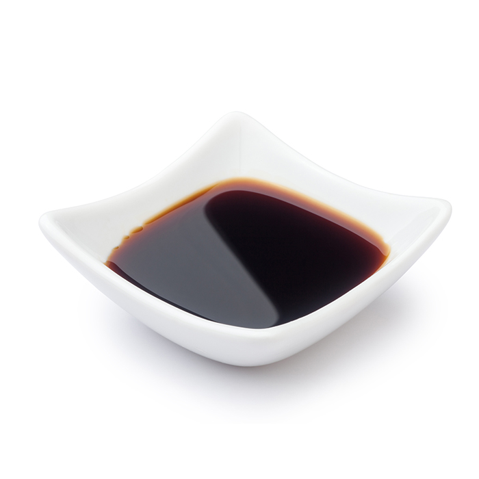{:width 115 :height 115}
	- 2 cuillères à soupe de sauce soja
	- 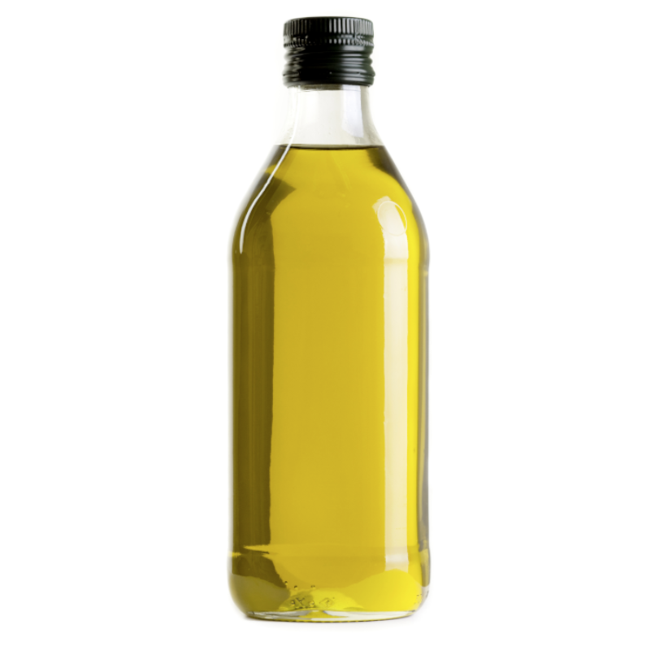{:width 115 :height 115}
	- huile d'olive
	- Voir plus Voir moins
	- En cliquant sur les liens, vous pouvez être redirigé vers d’autres pages de notre site, ou sur Amazon.fr
	- La suite après cette publicité
	- Ustensiles
	- 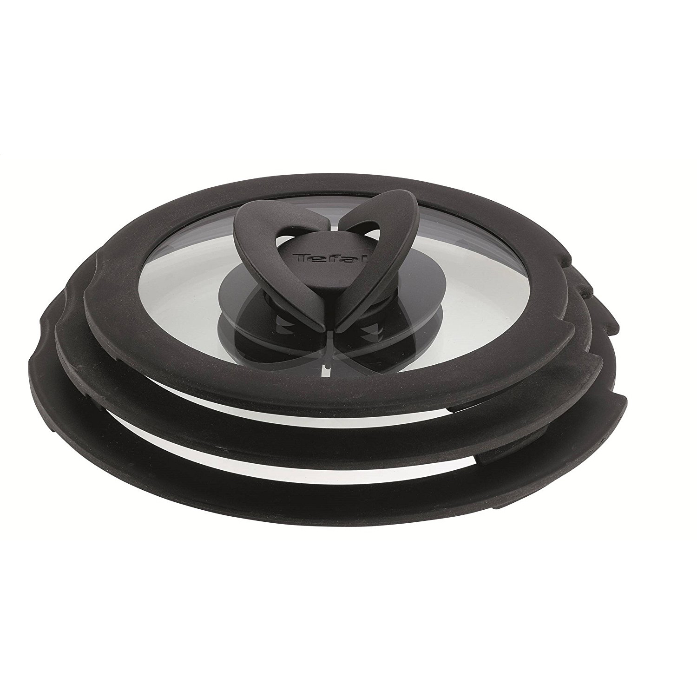{:width 89 :height 89}
	- 1 Couvercle
	- Les meilleures ventes
	- Acheter
	- 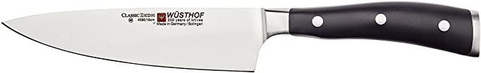{:width 89 :height 89}
	- 1 Couteau
	- Top des meilleurs couteaux de cuisine
	- \+ de détails
	- 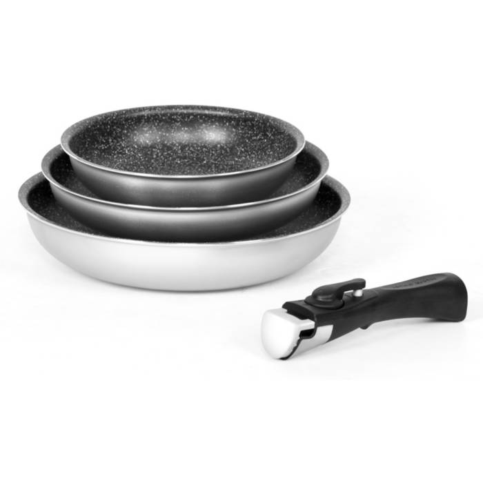{:width 89 :height 89}
	- 1 Set 3 poêles
	- Notre sélection des meilleures poêles
	- \+ de détails
	- 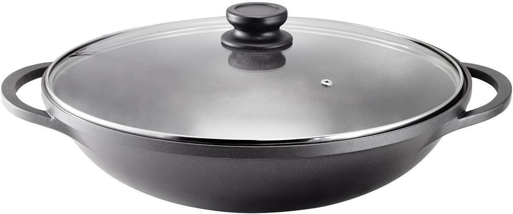{:width 89 :height 89}
	- 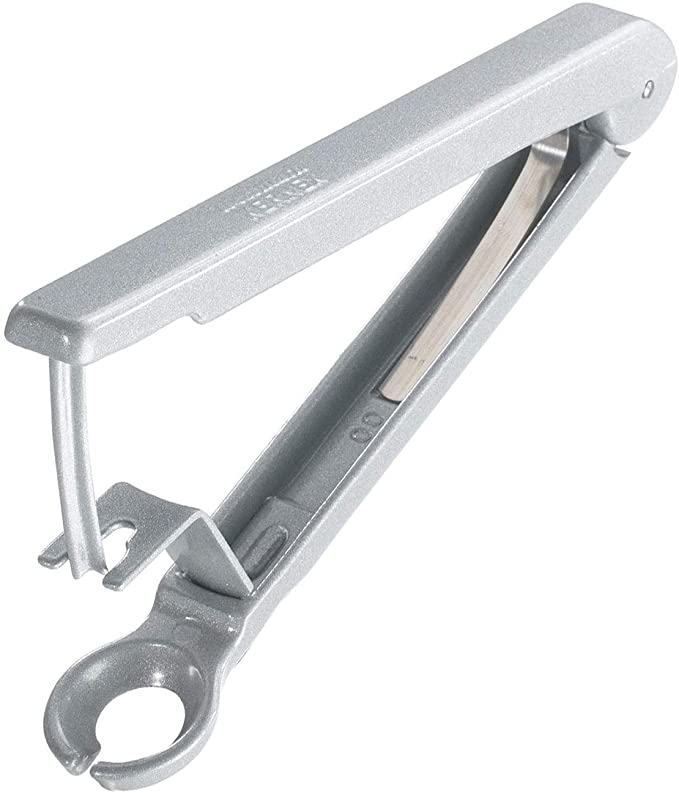{:width 89 :height 89}
	- 1 dénoyauteur
	- Les meilleures ventes
	- Acheter
	- 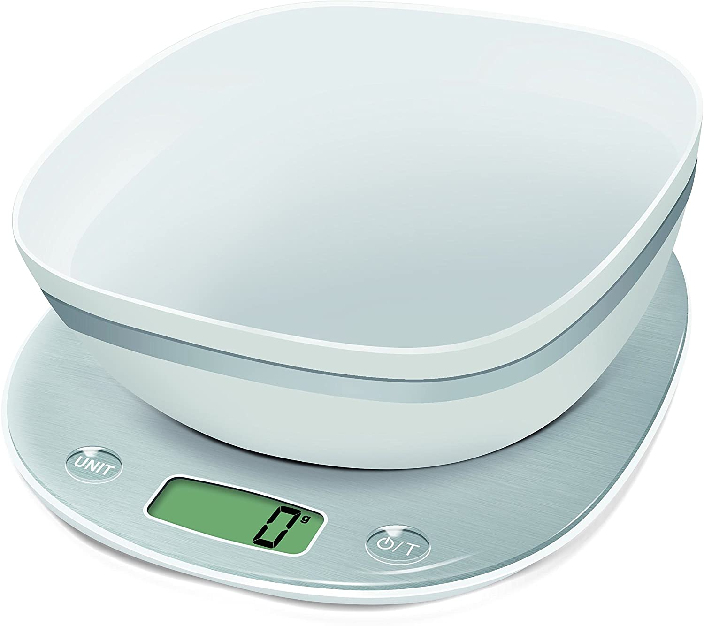{:width 89 :height 89}
	- 1 balance de cuisine
	- Top des meilleures balances
	- \+ de détails
	- Voir plus Voir moins
	- En cliquant sur les liens, vous pouvez être redirigé vers d’autres pages de notre site, ou sur Amazon.fr
	- Préparation
	- Temps total :
	- 30 min
	- Préparation :
	- 15 min
	- Repos :
	- \-
	- Cuisson :
	- 15 min
	- Étape 1
	- {:width 34 :height 34}{:width 34 :height 34}
	- Préparer les nouilles fines selon indications sur l'emballage. Elles peuvent déjà être cuites à l'avance. Comme cela, elles seront prêtes à temps. Les cuire al dente, ajouter un petit peu de beurre et les réserver.
	- Étape 2
	- 
	- Couper le poulet en petites lanières d'environ 1 sur 5 cm. Les disposer dans un bol et y verser 1 cuillère à soupe d'huile d'olive et 2 cuillères à soupe de sauce soja. Brasser le tout et couvrir.
	- Étape 3
	- 
	- Couper les oignons en 2 puis en fines lanières.
	- Étape 4
	- 
	- Couper les poivrons aussi en fines lanières.
	- Étape 5
	- 
	- Couper la carotte en petits tronçons fins ou à la râpe.
	- Étape 6
	- 
	- Dans une poêle à haut bord ou un wok, chauffer 1 petite cuillère d'huile d'olive, y ajouter les oignons, les poivrons et les bouts de carotte. Saler.
	- Étape 7
	- Cuire à feu moyen pendant 6 à 8 min en remuant souvent.
	- Étape 8
	- 
	- Ajouter un peu d'huile ou un tout petit peu d'eau si ça attache au fond. Les légumes doivent être juste cuits, encore un petit peu croquants. Les enlever de la poêle et les réserver.
	- Étape 9
	- 
	- Verser un filet d'huile dans la même poêle et faire chauffer à feu vif. Ajouter le poulet. Saler, poivrer, saupoudrer de sucre. Faire cuire pendant 5 min, un peu plus si nécessaire.
	- Étape 10
	- Il faut qu'il prenne de la couleur. Le tourner souvent.
	- Étape 11
	- 
	- Ajouter un peu d'huile si c'est trop sec.
	- Étape 12
	- {:width 34 :height 34}
	- Dès que le poulet est cuit, y ajouter les légumes, brasser un peu pour les réchauffer, puis ajouter les nouilles et brasser le tout brièvement juste le temps que tout soit bien chaud.
	- Qu'est-ce qu'on mange ce soir ?
	- De l'inspiration chaque jour avec des recettes faciles, gourmandes et de SAISON :)
	- \*En cliquant sur "Je m'inscris", vous acceptez que Marmiton vous envoie ses newsletters personnalisées et mesure vos intéractions avec celles-ci. En savoir plus
	- Marmiton, responsable de traitement, collecte ces données afin de vous adresser des communications commerciales personnalisées et en mesurer la performance et, sous réserve de votre accord dans le module de paramétrage des cookies, que vous pouvez retirer à tout moment, de rapprocher ces données avec d’autres données vous concernant afin d'enrichir le profil sur la base duquel sont personnalisées les contenus et publicités et vous afficher des contenus et publicités personnalisés. Pour en savoir plus sur la gestion de vos données personnelles et pour exercer vos droits, vous pouvez consulter notre [Politique de protection des données personnelles](https://www.reworldmedia.com/mentions-legales/politique-des-donnees-a-caractere-personnel-et-cookies?utm_source=marmiton.org).
	  Réduire
	- Commentaires (14)
	- La recette est terminée.
	- Donnez votre avis
	- H
	- Hyht93exq
	- 5/5
	- Très bien.
	- 31/10/2023 11:56
	- A
	- Alecto
	- 5/5
	- Très bonne recette ! Simple et efficace ^^ Personnellement j'ai rajouté un peu de piment pour relever le tout et c'était parfait !
	- 12/04/2023 07:56
	- Lire tous les commentaires